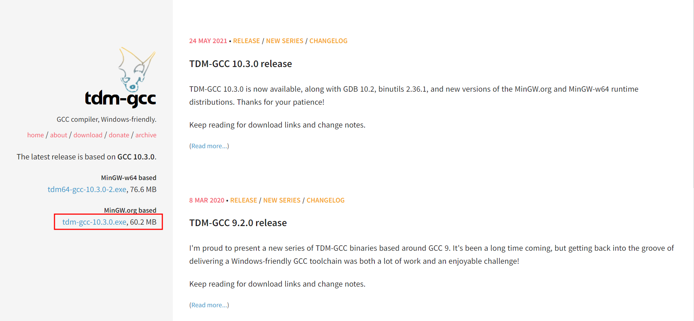
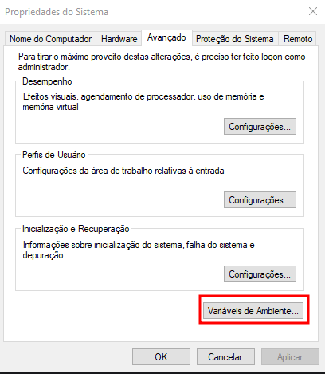
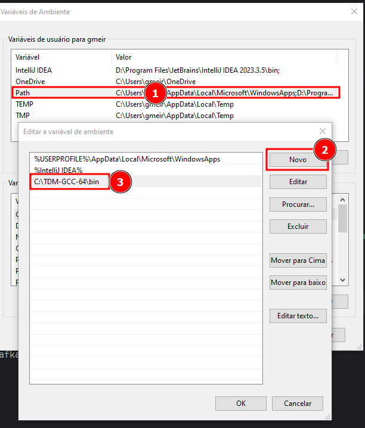

# Funcionamentos avançados do Kafka

## Primeiros passos

- Importante baixar o TDM-GCC-64 para Windows clique [aqui](https://jmeubank.github.io/tdm-gcc/)


- Logo após executar o .exe, pegue o diretório em que foi baixado (Ex: `C:\TDM-GCC-64\bin`)
- Abra seu gerenciador de variáveis



---

### Comandos para rodar na primeira vez:

- Suba o docker-compose no terminal: ```docker-compose up -d```

- Após baixar as imagens do kafka, acesse o bash: `docker exec -it gokafka bash`

- Utilize o comando: `go mod init github.com/gui-meireles/fc2-kafka-avanced`

- Baixe as dependências do GoLang em sua IDE (Eu utilizei o Intellij e ele fez tudo automático)

- Rode o arquivo `test.go` que está dentro de `cmd/producer` com o comando: `go run cmd/producer/test.go` 
dentro do bash do `gokafka`

> Caso apareça a mensagem "Hello Go" significa que está funcionando

### Em seguida:
- Abra um terminal
- Abra o bash do kafka: `docker exec -it fc2-kafka-advanced-kafka-1 bash`
- Vamos criar um tópico: `kafka-topics --create --bootstrap-server=localhost:9092 --topic=teste --partitions=3`

---

### Testar o envio e recebimento de mensagens para o kafka (via Terminal):

- Abra 2 terminais, com os nomes `producer` e `consumer`

<br>

- No terminal `consumer` rodaremos os comandos na ordem:
> - `docker exec -it fc2-kafka-advanced-kafka-1 bash`
> - `kafka-console-consumer --bootstrap-server=localhost:9092 --topic=teste`

<br>

- No terminal `producer` rodaremos os comandos na ordem:
> - `docker exec -it gokafka bash`
> - `go run cmd/producer/main.go`

Para cada `go run cmd/producer/main.go`, você verá o callback no terminal do `consumer`

---

### Testar o envio e recebimento de mensagens para o kafka (via Aplicação GO):

- Abra 2 terminais, com os nomes `goapp-producer` e `goapp-consumer`

<br>

- No terminal `goapp-consumer` rodaremos os comandos na ordem:
> - `docker exec -it gokafka bash`
> - `go run cmd/consumer/main.go`

<br>

- No terminal `goapp-producer` rodaremos os comandos na ordem:
> - `docker exec -it gokafka bash`
> - `go run cmd/producer/main.go`

Para cada `go run cmd/producer/main.go`, você verá o callback no terminal do `goapp-consumer`

---